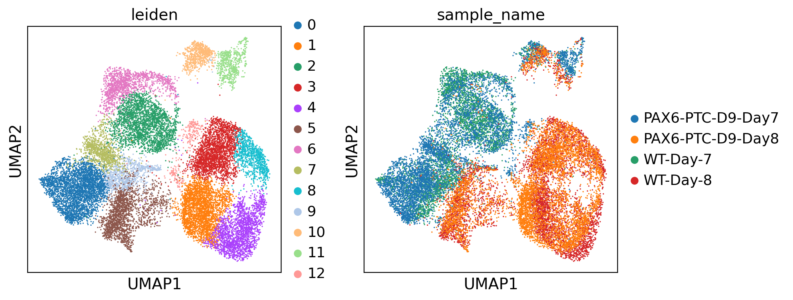
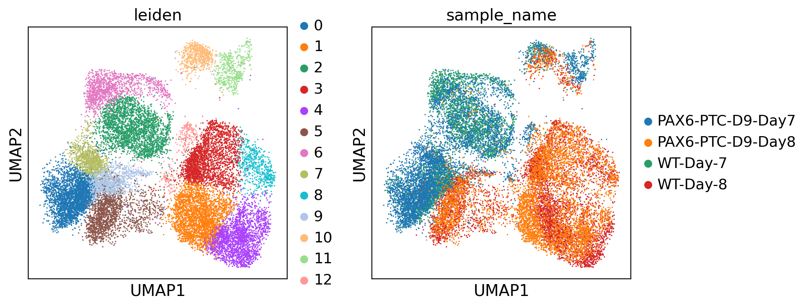
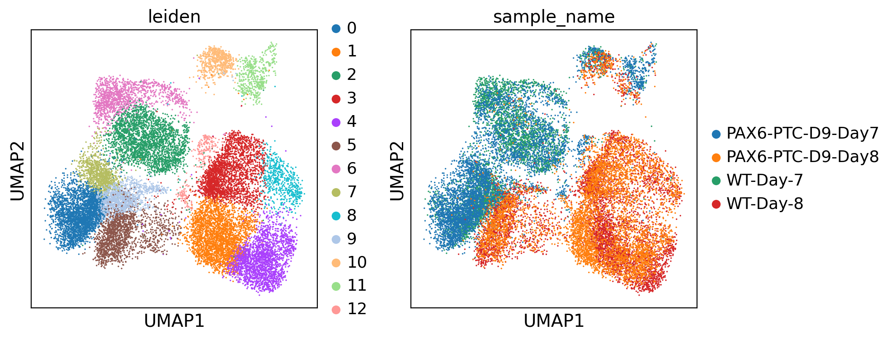
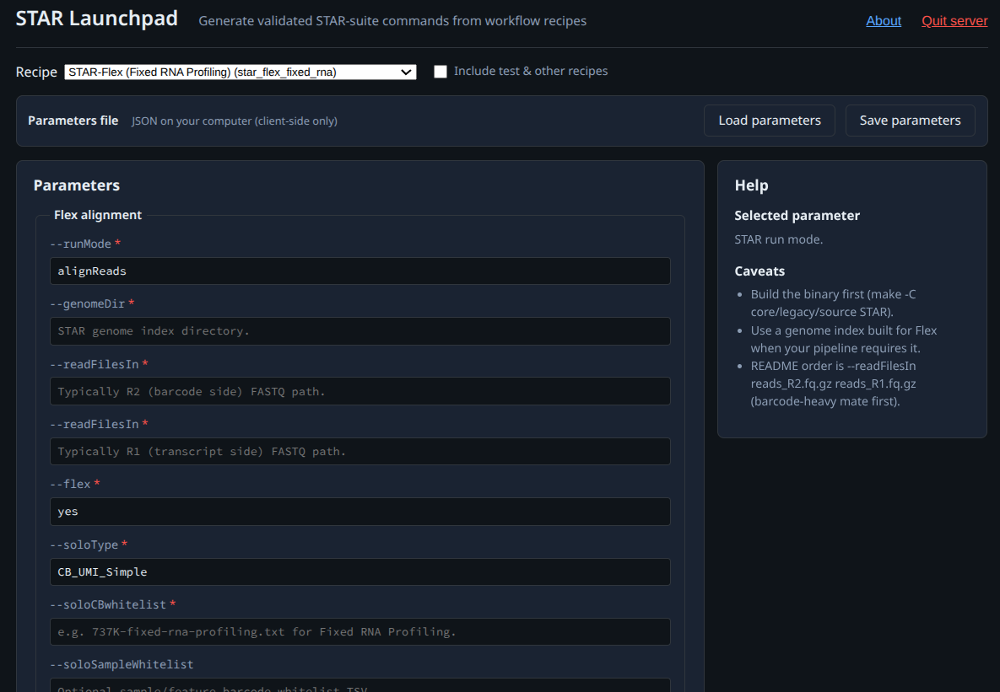

# STAR Suite

STAR Suite updates the original STAR aligner by integrating four modules — STAR-perturb, STAR-Flex, STAR-SLAM, and TranscriptVB — to provide complete internal C/C++ pipelines for bulk RNA-seq, scRNA-seq, Perturb-seq, 10x Flex, and SLAM-seq. The integration results in **substantial speedups** (**1.7–2.4x for bulk RNA-seq**, **1.47–1.60x for scRNA-seq GEX-only Solo vs CellGENI-style STARsolo**, **3.7–6.2x for Perturb-seq**, **2.5–28.8x for Flex**) and a simplified toolchain that can be **installed through pre-compiled binaries** for researchers and agents. **No new external dependencies** are required; the suite is built entirely with the existing STAR toolchain and vendored components. **This is a drop-in replacement for the STAR aligner.**

Paper-era maintenance release: **STAR Suite v1.4.3b**. The suite release tag
and packaging version are `v1.4.3b` / `1.4.3b-1`; `STAR --version` reports
`1.4.3b`. This scoped backport preserves the `v1.4.3` paper tree while fixing
ordinary Fastx STARsolo scaling for reviewers exercising that drop-in path.
Use `STAR --upstream-version` for the underlying upstream STAR base
(`2.7.11b`) and `STAR --genome-compat-version` for the genome index
compatibility string (`2.7.4a`).

Advanced-user previews live on `dev-release` or version-scoped
`dev-release-vX.Y.Z` branches. Immutable prerelease tags use `vX.Y.Z-rcN`;
stable releases are tagged from `master`.

STAR Suite supports partial compilation: build only the module/tool targets you need instead of building the full suite every time.

Agent quickstart: see `AGENTS.md` for repo-specific guardrails, tests, and recent changes.

## Core Additions over STAR 2.7.11b

- **Speedup**: Bulk RNA-seq **1.7–2.4x faster** than external stepwise pipelines; scRNA-seq GEX-only Solo **1.47–1.60x faster** than the CellGENI-style STARsolo parameter surface (UCSF 14K cells 1.60x, MSK 30K cells 1.47x on fresh `7a7fb08` reruns); Perturb-seq **3.7–6.2x faster** than Cell Ranger 9; Flex **2.5x faster** than Cell Ranger 9 full-count, **5.7x** in FASTQ no-genome count-only mode, and **8.0x** with indexed CBQ no-genome count-only input (~12.8–28.8x vs Cell Ranger 7 with BAM); PBMC multiome native GEX+ATAC CBQ is **1.10x faster** than the completed FASTQ.gz comparator — all with near-identical parity.
- **Batch Mode** (`--batchMode 1`): Processes multiple FASTQs in one STAR invocation while reusing the loaded genome. Removes the need for `--genomeLoad` keep-in-memory workflows. Single-pass only (no `--twopassMode`); not supported with Solo (`--soloType`). Use `--outFileNamePrefixAuto 1` for per-sample subdirectories.
- **TranscriptVB Quantification** (`--quantMode TranscriptVB`): Variational Bayes and EM quantification for transcript-level abundance, with parity-oriented behavior against Salmon alignment-mode. Gene-level summarization via `--quantVBgenesMode Tximport`.
- **Transcriptome Output** (`--quantTranscriptomeSAMoutput`): Replaces the former `--quantTranscriptomeBan` with more explicit control (e.g., `BanSingleEnd_ExtendSoftclip`).
- **Reference Automation** (`--autoIndex Yes`): Automated reference download/build with `--cellrangerStyleIndex Yes` formatting and `--genomeGenerateTranscriptome Yes` for transcript-level quant workflows.
- **Native Gzip FASTQ Handling**: Automatic detection of `.gz` FASTQ inputs with internal zlib streaming — no `--readFilesCommand zcat` needed for correctness. FLEX FASTQ production recipes use this path by default; legacy external helper mode remains available via `--readFilesLegacyZcat Yes`.
- **CBQ/BINSEQ Input** (`--readFilesType Binseq PE|SE`): Native C++ CBQ reader plus an order-preserving FASTQ/FASTQ.gz-to-CBQ encoder for STAR mapper, STARsolo, OCM, Flex, SLAM, and process_features adapter workflows. Exact FASTQ-vs-CBQ parity smokes are registered in the production regression manifest. See [`docs/CBQ_FORMAT_AND_IMPLEMENTATION.md`](docs/CBQ_FORMAT_AND_IMPLEMENTATION.md) for the format and adapter reference. Multiome ATAC now also supports the native libchromap CBQ path with paired-read and barcode CBQs.
- **Cutadapt-Compatible Trimming** (`--trimCutadapt Yes`): Native cutadapt-style trimming for bulk/PE workflows. Compatibility mode: `--trimCutadaptCompat Cutadapt3`.
- **Poly-G Trimming** (`--clip3pPolyG yes|no|auto`): Trims poly-G artifacts common on NovaSeq/NextSeq platforms. Default `auto` activates in CellRanger4 mode. Without this, poly-G reads can inflate specific genes (e.g., LINC00486) and degrade gene-level correlations.
- **Samtools-style BAM Sorting** (`--outBAMsortMethod samtools`): Spill-to-disk sort to reduce peak RAM pressure. Works with all modes including Flex.
- **Y/NoY Separation** (`--emitNoYBAM yes`, `--emitYNoYFastq yes`): Split BAM and FASTQ outputs by chrY alignment. Works with bulk, single-cell, and Flex.
- **EmptyDrops_CR Integration**: CR-compatible EmptyDrops path (including libscrna-backed behavior in scRNA/perturb flows).
- **Solo Features**: `sF` BAM tag for feature type, `--soloCBtype String` for arbitrary barcode strings, `--soloCellReadStats Standard` for improved cell filtering.
- **CR-compat GEX** (`--soloCrGexFeature auto|gene|genefull`): Controls which GEX source is merged in CR-compat mode.
- **Native Velocyto MEX Packaging**: Current production binaries write raw and
  filtered Velocyto MEX under `outs/` internally. `prepare_velocyto_mex.py` is a
  legacy repair/backfill helper for old STAR outputs, not the normal production
  path.
- **OCM Composite Barcode Mode** (`--ocmMultiEnable yes`,
  `--ocmMultiBarcodeMode flex`): 10x OCM runs can promote the barcode to an
  effective `CB16+OCM_TAG8` before correction, UMI collapse, and Velocyto,
  run per-sample CR-compatible EmptyDrops after the OCM split, then emit Cell
  Ranger multi-compatible `outs/multi`,
  `outs/per_sample_outs`, and per-sample downstream mirrors.
- **CB/UB Tag Pairing** (`--soloCbUbRequireTogether yes|no`): Enforce CB/UB tag pairing for tag injection (default `yes`).

## Folder Structure

```
core/
  legacy/                        # Canonical STAR core tree (upstream layout preserved; not deprecated)
  features/                      # Shared overlays and feature tooling
    process_features/            # Perturb feature extraction/calling implementation
    feature_barcodes/            # Standalone barcode tools (assignBarcodes, demux)
    libscrna/                    # EmptyDrops/OrdMag/Occupancy shared library
flex/                    # Flex-specific code + tools
slam/                    # SLAM-seq code + tools
build/                   # Modular make fragments
scripts/                 # Suite-level helper scripts (see scripts/README.md)
docs/                    # Suite-level docs
tests/                   # Suite-level tests (see tests/ARTIFACTS.md for artifact locations)
tools/                   # Suite-level scripts/utilities
mcp_server/              # MCP server for scripted discovery/preflight/run workflows
```

## Modules

- **STAR-core** (`core/`): Legacy STAR (indexing, bulk, Solo) plus shared utilities.
  Build: `make core` for the Chromap-enabled multiome-capable binary at
  `core/legacy/source/STAR`; use `make core-portable` for an explicit
  no-Chromap compatibility build.
- **STAR-perturb** (`core/legacy/` + `core/features/process_features/`): CR-compatible perturb-seq path with integrated feature extraction/calling (`process_features` + `call_features`) and `crispr_analysis/` outputs in CR-compat mode.
  Primary run path: `STAR --pfMultiConfig ... --defaultCrCompat yes` (see STAR-perturb section below).
- **STAR-OCM scRNA-seq** (`core/legacy/`): GEM-X OCM support on the CR-compatible
  GEX path. Production uses `GeneFull Velocyto`, per-sample `EmptyDrops_CR`
  after OCM split, native `CB16+OCM_TAG8` effective barcodes, native per-sample
  MEX/Velocyto materialization, and optional Y/noY side outputs.
- **STAR-Flex** (`flex/`): FlexFilter pipeline and Flex-specific integrations.
  Build tools: `make flex` or `make flex-tools`.
- **STAR-SLAM** (`slam/`): SLAM-seq quantification, SNP masking, trimming/QC.
  Build tools: `make slam` or `make slam-tools`.
- **Feature Barcodes** (`core/features/feature_barcodes/`): Standalone barcode tools (`assignBarcodes`, `demux_bam`, `demux_fastq`) for perturb-seq testing.
  Build tools: `make feature-barcodes-tools`.
- **Process Features** (`core/features/process_features/`): Full feature extraction/calling pipeline (`assignBarcodes`, `call_features`, `demux_bam`, `demux_fastq`) and standalone tool (`star_feature_call`).
  Build tools: `make process-features-tools`, `make star-feature-call`.
- **Shared Feature Toolchains** (`core/features/`): Reusable tool layers used across modules, including `vbem` (TranscriptVB helpers), `yremove_*` (Y/noY splitting), `bamsort`, and `libscrna`.
  Build tools: `make vbem-tools`, `make yremove-tools`, plus in-core integrations.
- **MCP Server (tooling)** (`mcp_server/`): Agent automation service for dataset/test discovery and controlled execution (`list_datasets`, `list_test_suites`, `preflight`, `run_script`, `collect_outputs`), plus **STAR Launchpad** (`/launchpad/`) in the browser for workflow recipes (defaults to **`star_*`** CLI recipes; optional full list). See [`mcp_server/README.md`](mcp_server/README.md).
- **Helper Scripts** (`scripts/`): Standalone Python and Bash tools for FASTQ preflight, QC, parity benchmarking, downstream h5ad processing, and fixture management. These are not compiled into STAR; they run independently. Highlights include `preflight_library_pairing.py` (chemistry detection and library pairing for mislabeled Perturb-seq), `report_additional_parity_metrics.py` (STAR vs CR parity), and `build_gene_full_velocyto_h5ad.py` (Velocyto h5ad packaging). See [`scripts/README.md`](scripts/README.md) for the full catalogue.

## Benchmarks

All benchmarks run on pikachu (i9-13900KF, 126 GB RAM, 32 threads). The
table below keeps the README focused on the headline results. Publication-facing
wrappers live in [publications/benchmarks/README.md](publications/benchmarks/README.md),
archived benchmark artifacts live in
[comparisons/paper_benchmarks_20260318/README.md](comparisons/paper_benchmarks_20260318/README.md),
and detailed Velocyto bridge results live in
[docs/VELOCYTO_BENCHMARKS.md](docs/VELOCYTO_BENCHMARKS.md).
For bulk RNA-seq, use the checked paper wrapper for headline speedups. The
production STAR-suite arm uses internal TranscriptVB only; integrated
TranscriptomeSAM emission and integrated Salmon QC are opt-in parity artifacts
via `--parity-qc` and are excluded from production timing. Ad-hoc serial chains
with different trimming or BAM-output modes are useful sanity checks but are not
replacements for the wrapper ratios.

| Workflow | Dataset / surface | Baseline | STAR-suite result | Key parity / note |
|---|---|---|---|---|
| Bulk RNA-seq | JAX PE 6.5M | External stepwise wrapper (trimvalidate + STAR + Salmon) | Corrected production-mode wrapper in `scripts/paper/run_pe_bulk_feature_benchmark.sh`; archived parity-QC mode was **37 s** without Y-removal, **61 s** with Y-removal | Transcript Pearson **0.995**, gene Pearson **0.997** vs Salmon in parity-QC mode |
| Bulk RNA-seq | PPARG PE 35.1M | External stepwise wrapper (decompress + trimvalidate + STAR TranscriptomeSAM + Salmon) | Production-mode no-Y rerun: **8m 55s** STAR-suite vs **16m 10s** external; **1.81x** faster. Integrated arm used trim + align + sorted BAM + internal TranscriptVB, with no integrated transcriptome BAM or Salmon QC; archived parity-QC mode was **9m 35s** without Y-removal, **11m 58s** with Y-removal | Same integrated trim + align + TranscriptVB production path; parity artifacts opt-in via `--parity-qc` |
| scRNA-seq Solo | UCSF `EBs2_2` GEX-only | Historical CellGENI-style STARsolo (`7a7fb08`) | **13.75 min** optimized `zcat` vs **22.1 min** historical rerun; **1.60x** faster | Fresh historical rerun reproduced **13,847** cells, Jaccard **0.9891**, gene Pearson **0.964305** vs CR9; current `zcat` surface calls **13,723** cells with gene Pearson **0.994885** |
| scRNA-seq Solo | MSK 30polyKO GEX-only | Historical CellGENI-style STARsolo (`7a7fb08`) | **19.40 min** archived modern wall vs **28.6 min** historical rerun; **1.47x** faster | Fresh historical rerun reproduced **32,304** cells, Jaccard **0.9975**, gene Pearson **0.954925** vs CR9; guarded current surface calls **33,092** cells with Jaccard **0.974**, gene Pearson **0.994554** |
| Perturb-seq | A375 1k CRISPR 5' GemX | Cell Ranger 9 | **4.0 min**; **3.8x** faster | Jaccard **0.976**, gene Pearson **0.975**, CRISPR match **100%** |
| Perturb-seq | UCSF `EBs2_2` | Cell Ranger 9 | **16.4 min**; **3.7x** faster | Jaccard **0.976**, gene Pearson **0.995**, CRISPR match **98.9%** |
| Perturb-seq | MSK 30polyKO (DE sample, post-permits-fix) | Cell Ranger 9 (separate GEX+gRNA and GEX+LARRY runs) | STAR **26.9 min** vs CR **168 min**; **6.2x** faster (paired 2026-04-03 STAR + 2026-03-06 CR; CR is deterministic) | 33,095 STAR cells / 32,256 CR cells, Jaccard **0.9742**, per-barcode Pearson **0.9999**, gene Pearson **0.994554** (Gene Expression, all common features), CRISPR set-equivalent **98.04%** (23,063/23,525). Full report: [`comparisons/msk_30polyko_full_benchmark_20260306/post_permits_20260403/README.md`](comparisons/msk_30polyko_full_benchmark_20260306/post_permits_20260403/README.md) |
| Perturb-seq | MSK 30polyKO (ES sample) | Cell Ranger 9 (separate GEX+gRNA and GEX+LARRY runs) | **30.2 min** vs CR **167.1 min**; **5.5x** faster | 33,226 STAR cells / 32,670 CR cells, Jaccard **0.982**, per-barcode Pearson **0.9999**, gene Pearson **0.9937** (filtered, 16,958 genes), CRISPR set-equivalent **98.97%** (25,894/26,164), CRISPR UMI Pearson **0.9994**. Full report: [`comparisons/msk_30polyko_full_benchmark_ES_20260430/README.md`](comparisons/msk_30polyko_full_benchmark_ES_20260430/README.md) |
| Flex | JAX SC2300771 4-tag full / no-genome count-only | Cell Ranger 9 / FASTQ.gz internal-gzip | **23m 22s** full (**2.5x** vs CR9); no-genome count-only **10:17.97** from FASTQ.gz internal gzip (**5.7x** vs CR9) and **7:22.46** from indexed level-0 CBQ (**1.40x** faster than FASTQ; **8.0x** vs CR9) | Fresh canonical 4-tag full reruns (`BC004/BC006/BC007/BC008`) reproduce **20,316** cells; mean Jaccard **0.981**, cell Pearson **0.99997**, gene Pearson **0.99993** vs CR9. FASTQ no-genome outputs are byte-identical to whole-lane CBQ; indexed CBQ counters match. |
| SLAM-seq | NW SLAM R1/R2 PE smoke + NW-5-21 ARID1A compat mode | SE/PE 100K smoke, GEDI / GRAND-SLAM family | Integrated alignment + TranscriptVB quantification with GrandSLAM and cB outputs; no apples-to-apples end-to-end wall-time claim reported | PE smoke treatment NTR Pearson **0.9728** vs R1-only SE; Tximport gene NumReads Pearson **0.9322** treatment / **0.9385** noSU; historical GEDI NTR Pearson **0.967-0.978** |
| Multiome ATAC | PBMC 3k 10x Multiome benchmark; current production recipe uses one local STAR/Chromap pass for GEX `EmptyDrops_CR`, Velocyto, Y/noY output, concurrent low-memory Chromap ATAC, sorted BAM, and binary sidecar (`--chromapAtacSecondaryFragments star_out/atac_fragments.bin`), followed by native sidecar peak/MEX materialization with `star_multiome_atac_peak_mex` | Cell Ranger ARC v2.2.0 same fixture (`cellranger-arc count --create-bam=true --nosecondary --disable-cell-annotation --localcores=32`); **40:04 (2404 s)**. Completed FASTQ.gz STAR/Chromap comparator on the same PBMC set used external `zcat`: **20:40.05**, **520.89M reads/hr**, RSS **46.3 GB**. | Historical integrated benchmark: **18:17.52 (1097.52 s); 2.19x faster** than ARC. Native GEX+ATAC CBQ run: STAR/Chromap **18:46.41**, **582.23M reads/hr**, RSS **51.0 GB**; **1:53.64 faster** than the completed FASTQ.gz comparator (**9.2%**, **1.10x**) despite also emitting ATAC Y/noY BAMs. Sidecar peak/MEX adds **1:27.53** for a CBQ wrapper total of **20:13.94**. | CBQ run root: `/mnt/pikachu/atac-seq/10xMultiome/pbmc_unsorted_3k/star_libchromap_full_multiome_cbq_smoke_20260531T185430Z`; CBQ inputs: `/mnt/pikachu/atac-seq/10xMultiome/pbmc_unsorted_3k/source/full_cbq_level0_20260531T184230Z`. Required BAMs pass `samtools quickcheck`; noY BAM has `chrY=0`, Y BAM has `nonY=0`; ATAC peaks **50,274**. STAR diagnostics show CBQ input throughput **401.7 MB/s** vs **104.2 MB/s** on the completed FASTQ.gz comparator. |

Perturb-seq is the main performance result: on A375, UCSF, and MSK surfaces,
STAR-suite runs **3.7x-6.2x faster** than Cell Ranger 9 while maintaining
near-identical GEX/cell metrics and **98.0–100%** CRISPR call agreement.
The MSK 30polyKO comparison has been replicated on two independent samples
(DE and ES) — see [`docs/PAPER_BENCHMARK_MSK_DE_ES.md`](docs/PAPER_BENCHMARK_MSK_DE_ES.md)
for the side-by-side paper-grade table.

For non-Flex Solo, the README now summarizes only the historical CellGENI-style
baseline versus the current optimized surface. On this host, external `zcat`
remains the fastest validated read path for UCSF/MSK GEX-only and perturb runs;
native `.gz` input is functional but not yet the fastest on those surfaces.
Fresh `7a7fb08` reruns reproduced the archived CellGENI filtered barcode sets
exactly for both UCSF and MSK, so the historical Jaccards above are validated
rather than stale-artifact carryovers.

All perturb parity metrics above were computed with
`scripts/report_additional_parity_metrics.py --gene-corr-min-counts 20 --gene-corr-min-cells-pct 0.01`
per `docs/PAPER_BENCHMARK_METHODOLOGY.md`. CR9 references use
`refdata-gex-GRCh38-2024-A` unless noted otherwise in the archived benchmark
artifacts.

For MSK specifically, the historical raw-matrix EmptyDrops isolation result and
the real guarded end-to-end benchmark surface are separated in
[docs/MSK_BENCHMARK_SURFACE_AUDIT_20260403.md](docs/MSK_BENCHMARK_SURFACE_AUDIT_20260403.md).
The MSK 30polyKO Perturb-seq comparison is now reported on **two independent
samples** from the same NXT chemistry: DE
([comparisons/msk_30polyko_full_benchmark_20260306/](comparisons/msk_30polyko_full_benchmark_20260306/))
and ES
([comparisons/msk_30polyko_full_benchmark_ES_20260430/](comparisons/msk_30polyko_full_benchmark_ES_20260430/)).
Both use the same wrappers
(`scripts/paper/run_msk_30polyko_benchmark.sh` for STAR,
`scripts/paper/run_msk_30polyko_cr_benchmark.sh` for CellRanger 9), with parity
computed by `scripts/report_additional_parity_metrics.py` per
`docs/PAPER_BENCHMARK_METHODOLOGY.md`.

## Building & Installing

### From source

```bash
# Core STAR binary
make core

# Module-focused builds
make flex           # core + Flex tools
make slam           # core + SLAM tools

# Individual tool targets
make feature-barcodes-tools    # assignBarcodes/demux (standalone)
make process-features-tools    # full process_features pipeline
make star-feature-call         # standalone feature caller
make vbem-tools                # TranscriptVB helpers
make yremove-tools             # Y/noY splitting tools

# Default build (core + common tools)
make                           # or: make default

# Build everything
make all
```

Selective filtering:

```bash
make default INCLUDE="core slam-tools"
make default EXCLUDE="flex-tools"
```

Run `make help` to see the full target list and descriptions.

### From release artifacts

```bash
# Ubuntu package from a local artifact
sudo apt install ./star-suite_<version>_<arch>.deb

# Installer tarball (auto-detects host glibc level)
tar -xzf STAR-suite-<version>-linux-<arch>-installer.tar.gz
cd STAR-suite-<version>-linux-<arch>-installer
./install.sh

# Manual compatibility tarball
tar -xzf STAR-suite-<version>-linux-<arch>-glibc234.tar.gz
cd STAR-suite-<version>-linux-<arch>-glibc234
./install.sh
```

Release tarballs are validated in clean Ubuntu 22.04 and 24.04 Docker containers before publication. The installer bundle auto-detects the host glibc level and chooses the right bundled binary.

Packaging/release details and artifact policy:
- `docs/Star-binary-distribution.md`
- `docs/Github-actions.md`

Compilation details (module-by-module, clean rebuilds, and clean Ubuntu 24.04 validation):
- `docs/compile_instructions.md`

## Docker

A multi-stage Docker setup (Ubuntu 24.04) provides a clean build environment and separate runtime/test images.

**Builder stage**: Compiles STAR Suite from source with no host leakage. Validates `make core`, `flex`, `slam`, `feature-barcodes-tools`, `default`, and `all`.

**Suite base runtime (`suite-base`)**: Minimal executable image with suite binaries (e.g. `STAR`) and no Python/test-only helpers.

**Test images** (built from `suite-base`):
- `test-tier-a`: self-contained smoke helpers.
- `test-tier-b`: fixture-backed helper stack (e.g. `python3`, `bc`, `samtools`).

### Quickstart

```bash
# Build suite base image (default tag: biodepot/star-suite:latest)
./scripts/docker/build_image.sh

# Override tag or parallel jobs
IMAGE_TAG=myorg/star-suite:v1 MAKE_JOBS=8 ./scripts/docker/build_image.sh

# Reproducibility check: force a clean rebuild (no cache)
docker build --no-cache --target suite-base -f docker/Dockerfile -t biodepot/star-suite:latest --build-arg MAKE_JOBS=8 .

# Run STAR from suite base image
docker run --rm biodepot/star-suite:latest

# Run Tier A smoke tests (builds/uses test-tier-a image)
./scripts/docker/run_smokes_tier_a.sh

# Run Tier B smoke tests (builds/uses test-tier-b image; requires fixtures)
./scripts/docker/run_smokes_tier_b.sh
```

### Fixture mount for Tier B

Tier B tests require data under `/storage`. Mount your fixture root:

```bash
docker run --rm -v /path/to/your/data:/storage biodepot/star-suite:test-tier-b bash -c "tests/run_cbub_regression_test.sh"
```

By default, `./scripts/docker/run_smokes_tier_b.sh` uses `STORAGE=/storage`.
Set `STORAGE=/path` to override (script uses it for the `-v` mount).

Expected layout: `/storage/A375`, `/storage/flex_filtered_reference`, etc. See `plans/docker_plan.md` for full fixture roots.

### STAR_BIN override

Smoke tests honor `STAR_BIN` to decouple from source-relative paths. Docker smoke wrappers set `STAR_BIN=/usr/local/bin/STAR` automatically.

### Validation

See [docs/docker_validation.md](docs/docker_validation.md) for the latest portability check results.

## Module Reference

This section documents the key features and flags for each module. For standard STAR flags not listed here, see `core/legacy/README.md`. Core additions are listed above in [Core Additions over STAR 2.7.11b](#core-additions-over-star-2711b).

### Flex

See [flex/README_flex.md](flex/README_flex.md) for the full pipeline reference.

STAR-Flex uses a pseudo-chromosome alignment approach: probe sequences are embedded as pseudo-chromosomes in a hybrid reference genome, and STAR's native alignment machinery handles gene assignment. Core features (trimming, spill-to-disk sorting, Y-chromosome splitting, TranscriptVB) all work with Flex.

Key flags:
- `--flex yes`: Enable Flex pipeline.
- `--soloFlexExpectedCellsPerTag`: Expected cells per sample tag.
- `--soloSampleWhitelist`: TSV mapping sample tags to labels.
- `--soloProbeList`: Probe gene list (auto-detected from index if omitted).
- `--soloSampleProbes`: 10x probe barcode sequences file.

Features:
- Sample tag detection, 1MM pseudocount correction for CBs, clique-based UMI deduplication, and occupancy filtering.
- Y-chromosome splitting tested and validated (`tests/TEST_REPORT_Y_SPLIT_FLEX.md`).

#### Flex Parity: CR9-Projected Leiden UMAP

Using a fixed CR9 embedding removes the visual ambiguity from independently fit UMAPs. When full-align and no-align are both projected into the same CR9 PCA/UMAP space, they use the same 13 CR9 Leiden clusters and agree almost perfectly on shared cells: projected-label ARI `0.9979`, NMI `0.9967` on `20,315` shared cells.

| CR9 Reference | STAR-Flex Full Projected To CR9 | STAR-Flex No-Align Projected To CR9 |
|---|---|---|
|  |  |  |

### SLAM

See [slam/docs/SLAM_COMPATIBILITY_MODE.md](slam/docs/SLAM_COMPATIBILITY_MODE.md) and [slam/docs/SLAM_seq.md](slam/docs/SLAM_seq.md).

Integrated SLAM-seq quantification with paired-end support, GRAND-SLAM parity,
count-binomial output, and tximport-ready TranscriptVB gene counts:

Key flags:
- `--slamQuantMode 1`: Enable SLAM quantification.
- `--slamGrandSlamOut 1`: Generate GRAND-SLAM compatible output.
- `--slamCbOut 1 --slamCbFormat star|ezbakr`: Generate model-ready count-binomial output.
- `--slamMinCallableLength 30`: Require a minimum callable post-trim/overlap-consensus evidence length for SLAM transition statistics.
- `--slamCompatMode gedi`: Enable GEDI compatibility (intronic classification, lenient overlap, overlap weighting).
- `--slamCompatIntronic`, `--slamCompatLenientOverlap`: Fine-grained compat control.
- `--autoTrim variance`: Variance-based detection of artifact-prone read ends.
- `--slamTrim5p`, `--slamTrim3p`, `--slamCompatTrim5pMate1`, `--slamCompatTrim3pMate1`, `--slamCompatTrim5pMate2`, `--slamCompatTrim3pMate2`: Manual SE/PE trim guards.
- `--slamErrorRateFromBlank 1`: Seed error rate from a blank (e.g. no4sU) sample.
- `--outFileNamePrefixAuto 1`: Derive sample name from first FASTQ and route outputs into subdirs.
- `--slamDumpBinary 1 --slamDumpWeights 1`: Emit binary dumps for offline re-quantification with `slam_requant`.

Features:
- Full gene-level NTR estimation (Binomial/EM models).
- Paired-end transition coordinate handling with overlap consensus before counting.
- Fixed 2026-05 PE smoke trims for the NW panel: SE R1 `8/12`; PE R1 `8/13`, R2 `19/14`.
- Auto-trimming: variance-based detection of artifact-prone read ends.
- QC: comprehensive interactive HTML reports for T->C rates and error modeling.
- Batch layout organizes outputs into `alignments/`, `counts/`, `qc/`, `y_separated/`.
- Binary dump format documented in `slam/docs/SLAM_DUMP_FORMAT.md`.
- Reproducible PE smoke and production runbooks: `docs/RUNBOOK_SLAM_PE_100K_SMOKE.md`,
  `docs/RUNBOOK_SLAM_PE_DESEQ2_COUNT_SURFACES.md`, and
  `docs/RUNBOOK_SLAM_PE_PRODUCTION.md`.

### STAR-perturb / CR-Compat

See [docs/feature_barcodes.md](docs/feature_barcodes.md) and [docs/CRISPR_FEATURE_CALLING_IMPLEMENTATION_SUMMARY.md](docs/CRISPR_FEATURE_CALLING_IMPLEMENTATION_SUMMARY.md).

CR-compatible Solo behavior with integrated CRISPR feature calling:

Key flags:
- `--pfMultiConfig`: Cell Ranger-style multi processing with feature libraries.
- `--defaultCrCompat yes`: Apply the CR-compat perturb defaults bundle.
- `--dynamicThreadInterface 1`: Enable STAR/PF permit coordination.
- `--dynamicThreadConstMapPermits 32`: Start with full map-side permit budget.
- `--crAssignConsumerThreads 32`: Provision PF worker pool to full host budget.
- `--crAssignSearchThreads 1`: Per-consumer search-thread mode.
- `--crMinUmi`: Minimum UMI threshold for CRISPR feature calling (default `10`; lower to `2-3` for lineage barcodes).
- `--soloCrGexFeature`: Control merged GEX source (`auto`, `gene`, `genefull`).
- `--soloCrMode CR`: Enable CR-compatible single-cell behavior.
- `--crChemistry`: Barcode chemistry (`auto`, `NXT`, `TRU`). Default `auto` enables per-library auto-detection. Mixed NXT/TRU experiments are handled automatically; per-library overrides via the `star_chemistry` column in `--pfMultiConfig`.

Recommended execution profile (32-thread host):

```bash
--runThreadN 32 --dynamicThreadInterface 1 --dynamicThreadConstMapPermits 32 \
--dynamicThreadTelemetry 1 --crAssignConsumerThreads 32 --crAssignSearchThreads 1
```

Standalone tool (`star_feature_call`):
- `--compat-perturb`: CR9-compatible output layout (`crispr_analysis/`).
- `--feature-ref`, `--whitelist`, `--fastq-dir`, `--output-dir`: FASTQ -> MEX -> calls.
- `--call-only --mex-dir`: call_features-only pass on existing MEX.
- `--emptydrops-use-fdr`, `--min-umi`, `--ratio-test`: calling controls.

### OCM scRNA-seq

See [docs/RUNBOOK_SCRNA_OCM_CR_COMPAT.md](docs/RUNBOOK_SCRNA_OCM_CR_COMPAT.md),
[docs/RUNBOOK_SCRNA_OCM_MULTI_MEX_MATERIALIZER_IMPLEMENTATION_20260519.md](docs/RUNBOOK_SCRNA_OCM_MULTI_MEX_MATERIALIZER_IMPLEMENTATION_20260519.md),
and [docs/RUNBOOK_JAX_SCRNASEQ02_OCM_20260518.md](docs/RUNBOOK_JAX_SCRNASEQ02_OCM_20260518.md).

OCM is treated as a CR-compatible GEX run with an effective sample-aware cell
barcode, not as a guide-feature library. In production, STAR derives an OCM tag
from bases 8-9 of the raw 16 bp barcode, appends the internal TAG8 suffix before
barcode correction/counting, runs per-sample CR-compatible EmptyDrops after the
OCM split, and later strips that suffix from Cell Ranger-compatible output
labels.

Key flags:
- `--ocmMultiEnable yes`: emit OCM multi-compatible outputs.
- `--ocmMultiConfig <config.csv>`: Cell Ranger multi-style config with
  `[samples]` and `ocm_barcode_ids`.
- `--ocmMultiBarcodeMode flex`: production mode; count on `CB16+OCM_TAG8`.
- `--ocmMultiOutputCompat cellranger`: writes `outs/multi`,
  `outs/per_sample_outs`, and downstream `samples/<sample>/run/outs` mirrors.
- `--soloFeatures GeneFull Velocyto`: expression and velocity surface used by
  the downstream h5ad/CellBender path.
- `--soloCellFilter None`: current split-before-ED OCM production mode; the
  native OCM materializer applies CR-compatible EmptyDrops separately per OCM
  sample.

OCM production should also use the dataset-specific whitelist family, the
MSK/UCSF GRCh38 2024-A STAR reference, and Y-removal for KOLF2-derived JAX
samples.

### QC Outputs

- **SLAM QC** (`--slamQcReport <prefix>`): Interactive HTML report (`.html`) and JSON metrics (`.json`) for T->C conversion rates, variance analysis, and trimming overlays.
- **FlexFilter QC** (`flexfilter_summary.tsv`): Cell calling statistics (EmptyDrops/OrdMag), cell counts, UMI thresholds, and filtering rates per sample.

## Sample Commands

**Core alignment:**

```bash
core/legacy/source/STAR \
  --runMode alignReads \
  --genomeDir /path/to/genome_index \
  --readFilesIn reads.fq.gz \
  --outFileNamePrefix out/ \
  --outSAMtype BAM SortedByCoordinate \
  --outSAMattributes NH HI AS nM MD
```

**Batch mode (bulk, single-pass, SE):**

```bash
core/legacy/source/STAR \
  --runMode alignReads \
  --genomeDir /path/to/genome_index \
  --readFilesIn A_R1.fq.gz,B_R1.fq.gz \
  --outFileNamePrefix /path/to/out_root/ \
  --outFileNamePrefixAuto 1 \
  --batchMode 1 \
  --outSAMtype BAM SortedByCoordinate
```

**Batch mode (bulk, single-pass, PE):**

```bash
core/legacy/source/STAR \
  --runMode alignReads \
  --genomeDir /path/to/genome_index \
  --readFilesIn A_R1.fq.gz,B_R1.fq.gz A_R2.fq.gz,B_R2.fq.gz \
  --outFileNamePrefix /path/to/out_root/ \
  --outFileNamePrefixAuto 1 \
  --batchMode 1 \
  --outSAMtype BAM SortedByCoordinate
```

**Flex Mode (10x Fixed RNA Profiling):**

```bash
core/legacy/source/STAR \
  --runMode alignReads \
  --genomeDir /path/to/flex_index \
  --readFilesIn reads_R2.fq.gz reads_R1.fq.gz \
  --flex yes \
  --soloType CB_UMI_Simple \
  --soloCBwhitelist /path/to/737K-fixed-rna-profiling.txt \
  --soloSampleWhitelist sample_whitelist.tsv \
  --outFileNamePrefix output/
```

**SLAM Mode (Standard):**

```bash
core/legacy/source/STAR \
  --runMode alignReads \
  --genomeDir /path/to/genome_index \
  --readFilesIn reads.fq.gz \
  --outFileNamePrefix out/ \
  --outSAMtype BAM SortedByCoordinate \
  --outSAMattributes NH HI AS nM MD \
  --slamQuantMode 1 \
  --slamSnpBed /path/to/snps.bed
```

**SLAM Mode (GEDI Compatibility):**

```bash
core/legacy/source/STAR \
  --runMode alignReads \
  --genomeDir /path/to/genome_index \
  --readFilesIn reads.fq.gz \
  --slamQuantMode 1 \
  --slamCompatMode gedi \
  --autoTrim variance \
  --outFileNamePrefix output/
```

**SLAM PE 100K smoke (R1-only SE vs R1/R2 PE):**

```bash
bash scripts/run_slam_100k_se_pe_smoke.sh \
  --sample ARID1A-no4su_S50 \
  --sample ARID1A-6h-1_S43 \
  --threads 16
```

**SLAM PE production panel (safe dry-run default):**

```bash
bash scripts/run_slam_prod_set.sh \
  --pilot \
  --dry-run \
  --globus-dst-endpoint 61fb8b9a-9b52-456e-928c-30c0fb0140bf \
  --globus-dst-root SLAM-seq-PE-results
```

**SLAM Batch Mode (blank-first, SE/PE):**

```bash
core/legacy/source/STAR \
  --runMode alignReads \
  --genomeDir /path/to/genome_index \
  --readFilesIn blank_R1.fq.gz,0h_R1.fq.gz,6h_R1.fq.gz,24h_R1.fq.gz \
  --outFileNamePrefix /path/to/out_root/ \
  --outFileNamePrefixAuto 1 \
  --slamQuantMode 1 \
  --slamBatchMode 1 \
  --slamErrorRateFromBlank 1 \
  --slamSnpBed /path/to/snps.bed
```

For paired-end, pass **two comma-separated mate lists**:
`--readFilesIn blank_R1.fq.gz,0h_R1.fq.gz,... blank_R2.fq.gz,0h_R2.fq.gz,...`

**STAR-perturb (integrated CR-compat mode):**

```bash
core/legacy/source/STAR \
  --runMode alignReads \
  --runThreadN 32 \
  --genomeDir /path/to/index \
  --pfMultiConfig /path/to/multi_config.csv \
  --dynamicThreadInterface 1 \
  --dynamicThreadConstMapPermits 32 \
  --crAssignSearchThreads 1 \
  --defaultCrCompat yes \
  --outFileNamePrefix /path/to/outs/
```

**OCM scRNA-seq (native composite barcode mode):**

```bash
core/legacy/source/STAR \
  --runMode alignReads \
  --runThreadN 16 \
  --genomeDir /storage/autoindex_110_44/bulk_index \
  --readFilesIn "${R2_FILES}" "${R1_FILES}" \
  --readFilesCommand zcat \
  --outFileNamePrefix /path/to/library/run/ \
  --outSAMtype BAM Unsorted \
  --emitNoYBAM yes \
  --emitYNoYFastq yes \
  --clipAdapterType CellRanger4 \
  --clip3pPolyG yes \
  --soloType CB_UMI_Simple \
  --soloCBstart 1 --soloCBlen 16 \
  --soloUMIstart 17 --soloUMIlen 12 \
  --soloCBwhitelist /storage/scRNAseq_output/whitelists/3M-3pgex-may-2023_TRU.txt \
  --soloInlineCBCorrection yes \
  --soloCellFilter None \
  --soloFeatures GeneFull Velocyto \
  --soloCrGexFeature genefull \
  --soloCrMultimapRescue yes \
  --ocmMultiEnable auto \
  --ocmMultiConfig /path/to/cellranger_multi_config.csv \
  --ocmMultiBarcodeMode flex \
  --ocmMultiOutputCompat cellranger
```

**STAR-perturb (standalone feature pipeline):**

```bash
core/legacy/source/star_feature_call \
  --compat-perturb \
  --feature-ref /path/to/feature_reference.csv \
  --whitelist /path/to/whitelist.txt \
  --fastq-dir /path/to/feature_fastqs \
  --filtered-barcodes /path/to/filtered_barcodes.tsv \
  --output-dir /path/to/feature_out \
  --emptydrops-use-fdr \
  --min-umi 10
```

## STAR Launchpad (Recipe Builder)

If you prefer not to assemble command lines by hand, STAR Launchpad is a
browser-based recipe builder served from the STAR-suite MCP server. Select a
workflow, fill in parameters through a guided form, and get a validated,
copy-pasteable shell command.



### Quick start

```bash
# Install dependencies (once)
pip install -r mcp_server/requirements.txt

# Start Launchpad + MCP on one port
bash scripts/launchpad_server.sh up

# Open in your browser
# http://localhost:8765/launchpad/
```

### MCP endpoints

When the server is running on port `8765`, the main endpoints are:

- `http://127.0.0.1:8765/launchpad/` — Launchpad UI
- `http://127.0.0.1:8765/` — MCP streamable-HTTP endpoint
- `http://127.0.0.1:8765/sse` — MCP SSE endpoint

### MCP client setup

Use the endpoint that matches your client. If the server is running on another
host or port, replace the URL accordingly.

#### VS Code / GitHub Copilot

VS Code and GitHub Copilot use MCP over HTTP. Add a workspace config at
`.vscode/mcp.json`:

```json
{
  "servers": {
    "starSuite": {
      "type": "http",
      "url": "http://127.0.0.1:8765/"
    }
  }
}
```

Then reload the VS Code window or use the MCP commands in the Command Palette
to restart the server listing.

#### Cursor

Cursor uses the SSE MCP endpoint. Add this to your Cursor MCP config:

```json
{
  "mcpServers": {
    "star-suite": {
      "url": "http://127.0.0.1:8765/sse"
    }
  }
}
```

If Cursor is already open, reload the window after updating the config.

#### Claude

Claude can register the server over streamable HTTP:

```bash
claude mcp add --transport http star-suite http://127.0.0.1:8765/
```

Useful follow-up commands:

```bash
claude mcp list
claude mcp get star-suite
```

If you are connecting from another machine, use the remote host or public URL
instead of `127.0.0.1`.

### What it does

1. **Pick a recipe** -- choose a workflow (e.g. A375 CR-compatible alignment).
2. **Fill the form** -- parameters are grouped by category with defaults
   pre-filled, descriptions as help text, and constraints shown inline.
3. **Validate** -- the server checks required fields, types, and constraint
   rules. Errors and warnings appear inline.
4. **Generate** -- get the full bash command, environment variable overrides,
   and a checklist of required input files.
5. **Copy and run** -- paste the command into your terminal.

Launchpad does not execute anything. It generates commands; you run them.

Design details: [`plans/star_launchpad_v1_runbook.md`](plans/star_launchpad_v1_runbook.md)

## Codespaces Walkthroughs

STAR Suite includes GitHub Codespaces walkthroughs for the main module entry points.

Start here:
- [Codespaces walkthrough summary](docs/CODESPACES_DEMO_WALKTHROUGHS_20260312.md)
- [Codespaces overview](docs/codespaces/00_overview.md)

Ready now:
- [Optional setup: build the small demo reference](docs/codespaces/01_setup_reference.md)
- [Bulk demo](docs/codespaces/02_bulk.md)
- [SLAM demo](docs/codespaces/03_slam.md)
- [Single-cell fixture builder](docs/codespaces/04_single_cell_fixture.md)

Work in progress:
- [Perturb demo](docs/codespaces/05_perturb.md)
- [Flex demo](docs/codespaces/06_flex.md)

Helpful follow-up guides:
- [If you already use STAR or Cell Ranger](docs/codespaces/07_star_cellranger_users.md)
- [Using your own data](docs/codespaces/08_using_your_own_data.md)

## More Detail

- Core usage: [core/legacy/README.md](core/legacy/README.md)
- Flex pipeline: [flex/README_flex.md](flex/README_flex.md)
- SLAM compatibility: [slam/docs/SLAM_COMPATIBILITY_MODE.md](slam/docs/SLAM_COMPATIBILITY_MODE.md)
- SLAM methodology: [slam/docs/SLAM_seq.md](slam/docs/SLAM_seq.md)
- STAR-perturb feature docs: [docs/feature_barcodes.md](docs/feature_barcodes.md)
- OCM scRNA-seq runbook: [docs/RUNBOOK_SCRNA_OCM_CR_COMPAT.md](docs/RUNBOOK_SCRNA_OCM_CR_COMPAT.md)
- Velocyto CR-compat policy runbook: [docs/RUNBOOK_VELOCYTO_CR_COMPAT_POLICY_20260519.md](docs/RUNBOOK_VELOCYTO_CR_COMPAT_POLICY_20260519.md)
- STAR Suite binary distribution: [docs/Star-binary-distribution.md](docs/Star-binary-distribution.md)
- STAR-perturb A375 parity report: [tests/crispr_feature_calling_comparison_report.md](tests/crispr_feature_calling_comparison_report.md)
- Cell Ranger multi smoke tool: [docs/cr_multi.md](docs/cr_multi.md)
- Docker validation: [docs/docker_validation.md](docs/docker_validation.md)
